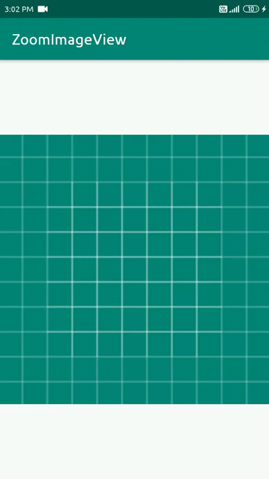

# ZoomImageViewLibrary
An android library to extend Image view functionality like double tab to zoom,two finger zoom etc




How to use
---
Step 1. Add the JitPack repository to your build file. Add it in your root build.gradle at the end of repositories:
```gradle
allprojects {
  repositories {
    ...
    maven { url "https://jitpack.io" }
  }
}
```

Step 2. Add the dependency
```gradle
dependencies {
     implementation 'com.github.AdnanMahida:ZoomImageViewLibrary:1.0.0'
}
```

Usage
---
```xml
<com.ad.zoomimageview.ZoomImageView
        android:layout_width="match_parent"
        android:layout_height="match_parent"
        android:src="@drawable/ic_launcher_background" />
```

Done <3
